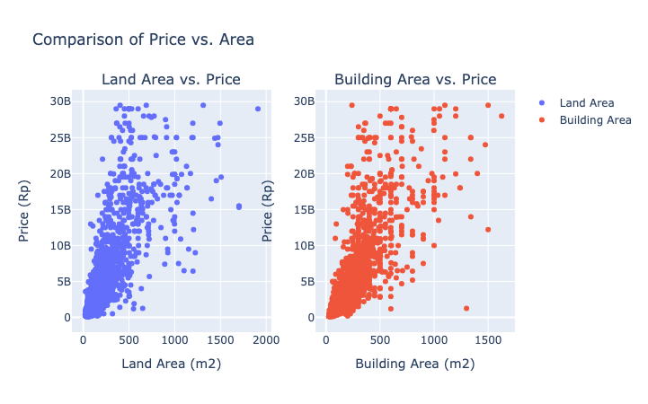
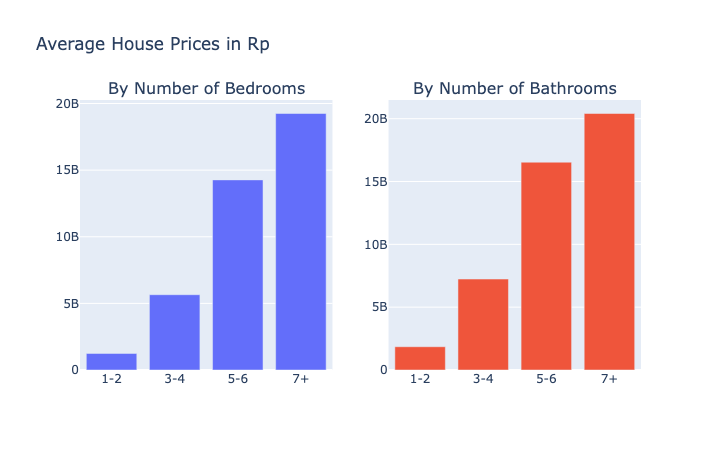
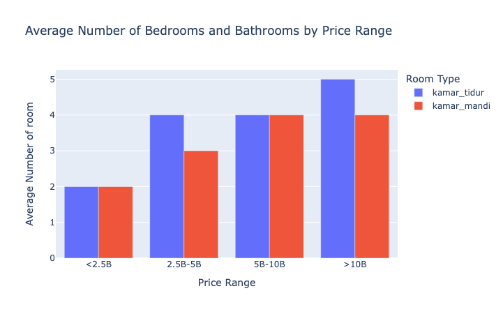

# Gender Pay Gap Analysis using Employee Salary Data

## Table of Contents

- [Project Overview](#project-overview)
- [Data Sources](#data-sources)
- [Results and Findings](#results-and-findings)

### Project Overview
---

Conducted an Exploratory Data Analysis on a dataset obtained from web scraping property websites, focusing on factors affecting house selling prices in Jakarta. Incorporated geospatial data analysis in analyzing regional price disparities, the study concluded that houses closer to the center of Jakarta are generally more expensive. Additionally, the study revealed that land and building area have a more pronounced effect on pricing compared to the number of bedrooms or bathrooms. This analysis provides valuable insights into the property market trends in Jakarta.

### Data Sources

The dataset used is data from web scraping results from property marketplace websites. This dataset consists of all the features that help in predicting the selling price of a house. From the scraped data, there is a total of 2,565 house data along with 9 variables related to the house specifications which will be analyzed further. The following is detailed information regarding the data:

| Variable Name          | Data Information                                                   |
|------------------------|-------------------------------------------------------------------|
| city                   | is the name of the city this property is located in               |
| location               | is the detailed location of the property, including the area and complete address of the property |
| land_area              | information on the land area of the property in square meters     |
| building_area          | information on the building area of the property in square meters |
| bed_rooms              | is the number of bedrooms in the property                         |
| bathroom_room          | is the number of bathrooms in the property                        |
| price                  | is information on the price of the property in rupiah             |

### Tools

- Python, Pandas, NumPy, - Data Cleaning and Manipulation
- Matplotlib, Seaborn, Plotly - EDA, Visualization
- Folium - is a Python library used for visualizing geospatial data on an interactive map
- GeoPy - is a Python library for geocoding (converting an address into latitude and longitude)
- GeoPandas - extends the datatypes used by pandas to allow spatial operations like reading in spatial data formats (like shapefiles or GeoJSON), spatial joins, and visualization. For this analysis, it can associate house price data with specific spatial regions or points.
- Shapely - is a Python library for extracting lat-long coordinates and create geometric point objects for further geospatial operations, such as checking if a point lies within a particular region

### Geospatial Data Analysis

Through this geospatial exploration, we aim to gain a clearer understanding of how location plays a pivotal role in Jakarta's housing market dynamics.
- Determining the influence of a house's geographical location on its price within Jakarta.
- Identifying whether specific regions in Jakarta consistently having higher prices compared to others.
- Identifying the exact locations that exhibit the highest and lowest average house prices to understand the regional disparities.

**In the visualization above, it can be concluded:**
- The Central Jakarta area has the highest house prices compared to other areas in Jakarta, with an estimated average house price of IDR 12.5 billion. This can be attributed to the fact that the Central Jakarta city administration area is the central business and government area in the capital city of DKI Jakarta, so it is natural that the house price range in this area is among the most expensive.
- In second place in the order of highest prices is the South Jakarta area, with the average house price being IDR 11 billion. As is known, South Jakarta is an administrative area which is the center of business and entertainment in Jakarta.
- Meanwhile, the lowest house prices based on this data are in the East Jakarta area, with an estimated average price of IDR 2.1 billion. This may be attributed to the East Jakarta area which has fewer luxury office buildings and shopping centers, compared to other areas.

**House Price Analysis per Subdistrict:**
- The district with the highest average house price is in the Menteng area, Central Jakarta. As is generally known, Menteng is an important area in Jakarta. Many large houses, whose prices are now very high, and also luxury houses due to its very strategic location and in the center of the capital, Central Jakarta.
- The second highest in this data is the Setiabudi area, South Jakarta. This can be attributed to the fact that the majority of office buildings stands there and their very close access to shopping centers, making houses in this area prestigious and the dream of many residents of DKI Jakarta.
- If we look at it from a geographical perspective, it appears that there is a tendency for sub-district positions located in the middle of DKI Jakarta to have the most expensive prices compared to areas far from the center point. So it is indicated that the farther away the houses are from the midpoint of the DKI Jakarta plan, there is a tendency to have a lower estimated average house price.

### Exploratory Data Analysis

EDA involved exploring the data to answer key questions, such as:
- What are the factors that can determine the price of a house?
- Is the land area and building area of a house affect its selling price?
- Do the features of a house, such as the number of bedrooms and the number of bathrooms, affect the price of a house?

- In this data, the majority of houses have land areas under 500 square meters, and the same pattern can be seen in the building area data, where the majority in this data also have areas under 500 square meters.
- It can be seen that the higher the land area or building area of a house, the higher the price of the house. So it can be said that there is a tendency for a linear relationship between land area and building area on the price of a house.

- It can be clearly seen based on the comparison of average house prices, the more a house has the number of bedrooms or bathrooms, the higher the potential price of the house. This also indicates that there is a linear relationship between the number of bedrooms and bathrooms and the price of a house

- At an average price of under IDR 2.5 billion, the average number of bedrooms is 2 and the number of bathrooms is also 2.
- In the price range of IDR 2.5 billion to IDR 10 billion, it appears that houses have an average of 4 bedrooms and bathrooms.
- It was identified that the higher the house price, the more bedroom and bathroom space you have.

### Results and Findings

The analysis results are summarized as follows:
- Through the geospatial analysis, it is evident that the location of a house within Jakarta plays a crucial role in its valuation. Specifically, houses situated closer to the city center tend to have a higher average price compared to those located on the outskirts. This underscores the significance of the geographic loaction in the Jakarta housing market, emphasizing that proximity to the city's heart is a premium factor in determining property value.
- By performing correlation analysis, land area and building area appear to be more significant factors in determining house price than the number of bedrooms and bathrooms in this analysis. Meaning: As the land area increases, house prices tend to increase as well. The strong relationship shows that land area is a significant factor in determining house prices.
- Although there is a positive relationship between the number of bedrooms and the number of bathrooms on house prices, the relationship is not very strong.

### Limitations

- Geospatial analysis and also correlation do not mean cause and effect. So, while these variables may be related to house prices, that doesn't mean they cause changes in house prices. Further statistical analysis (such as regression) is needed to explore causal relationships.
- It would be more useful to carry out additional analysis, such as regression analysis, to calculate several factors simultaneously and measure the impact more comprehensively. 
- Investigating additional analyzed variables would be more relevant to provide a clearer understanding. For example, analyzing population density data in the housing area, identifying the facilities contained inside the house, as well as other supporting factors.

### References

1. [Folium documentation](https://pypi.org/project/folium/)
2. [GeoPy documentation](https://geopy.readthedocs.io/en/stable/)
3. [GeoPandas documentation](https://geopandas.org/en/stable/docs.html)
4. [Indonesia - Subnational Administrative Boundaries](https://data.humdata.org/dataset/cod-ab-idn)

